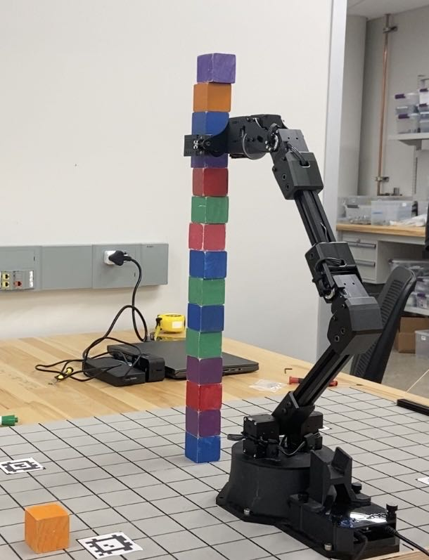
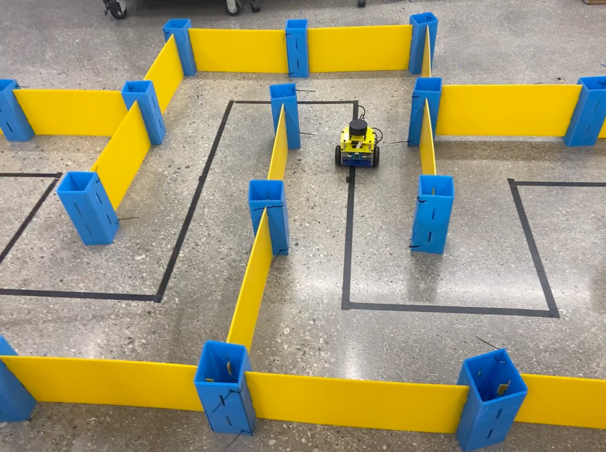

# ArmLab
<a href="../assets/reports/ROB_550_Robot_Control_S2T6.pdf" target="_blank"> (Read More) </a>

•	We implemented on a robotics arm (RX200 arm) with depth sensor camera. We implmented camera calibration, and object detection so that the camera is able to differentiated the colored block regarding to their size, height, and colors. Then we write python script to build up the GUI surface where we used to control robotics arm to grab and release the colored block to specific spot. This includes calculating the IF/FK for 6DOF arm, and path planning algorithms.

•	I participated in the whole project and I independently implemented RRT algorithm, collision check, and short-cut smoothing algorithm for the robotics arm to move consistently and efficiently.

# BotLab
<a href="../assets/reports/Botlab_Report_S2T6.pdf" target="_blank"> (Read More) </a>

• We aimed at building software in the MBot mobile robots, including the usage of Raspberry Pi, LiDAR scan, IMU, as well as using C++ and python for coding. We set up the MBot with RPi OS, assembly the car ourselves, and calibrate the motion and odometry using PID control, gyro sensor and build motion controller. In the part of software, we use LiDAR laser to help build the occupancy grid map, and we use SLAM applied via Particle Filter, building up the action model and sensor model. In the next part, we implement A star algorithm to help MBot to explore the map randomly built, so that it will go over the map to complete the occupancy grid map, and go back to home position using the shortest path after exploration.

• I participated in the whole process, and what worth to mention is that I mainly responsible for the path finding and map exploration part. Figured out a straight forward algorithm (Partial A* Algorithm) to plan a path to approach the frontier of the map, which solved the problem of finding path with unreachable frontiers.

