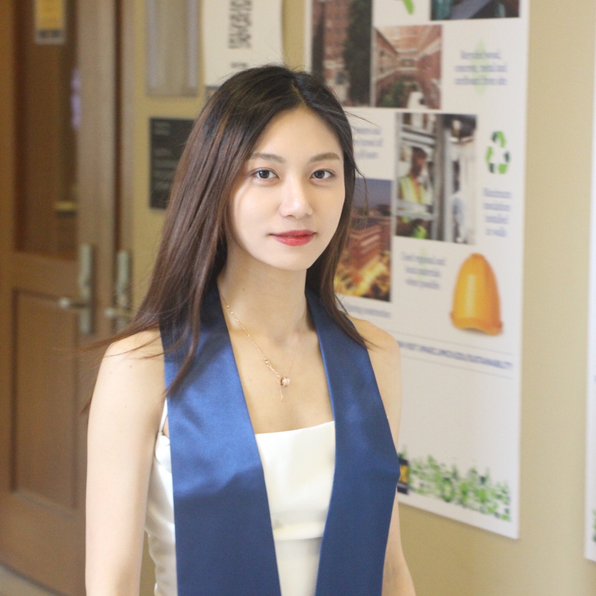

<b>Ke Liu</b>

Forever Young & Never-ending Passion

<!-- Hi! I'm **Ke Liu**. Currently a Master student in  [University of Michigan](https://umich.edu/) . -->

## Biography

Hi! I'm **Ke Liu**. Currently a Master student in 💛 <a href="https://umich.edu/"><b>University of Michigan</b></a> 💙.
In this April, I graduated from University of Michigan with a Bachelor of Science degree in Computer Science, Minor in Mathematics.
I enjoy traveling, cooking and baking, and music!
I will be seeking for New Grad position as a Software Engineer or a Robotics Engineer in fall23/24! 👩‍💻

## Education Experiences
- ### University of Michigan, Ann Arbor, 08/2022 - so far
    * College of Engineering, **Master of Science in Robotics**
    * Course: _EECS595 Natural Language Processing_, _ROB550 Robotic Systems Lab_
- ### University of Michigan, Ann Arbor, 01/2020 - 04/2022
    * LSA, **Bachelor of Science in Computer Science**, and **Minor in Mathematics**
    * Course: _EECS281 Data Structures and Algorithms_, _EECS370 Computer Organizations_, _EECS485 Web Systems_, _EECS482 Intro to Operating Systems_, _EECS442 Computer Vision_, _EECS445 Machine Learning_, _EECS441 Mobile Apps Development for Entrepreneurs_

## Interests
* Operating System
* Machine Learning
* Artificial Intelligence
* Robotics
* Control System
